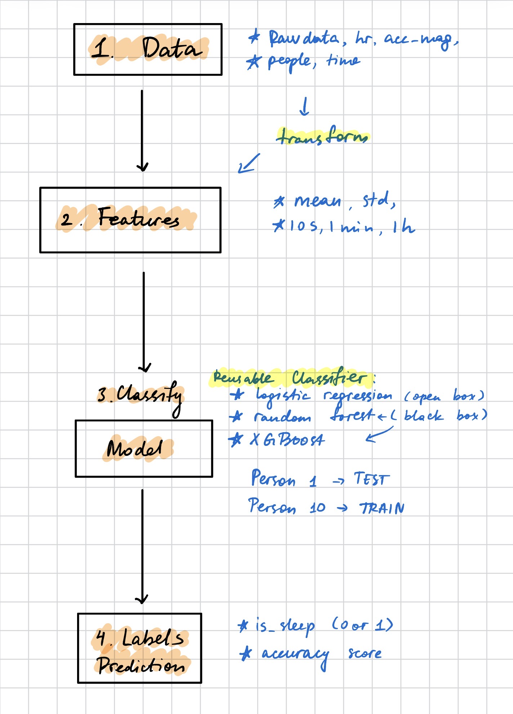

My understanding of Machine Learning:

In this class, I learned that machine learning is not just training a model. I learned that the main idea was building a conisistent pipeline that starts with reading data correctly, then transforming it into features, and using a classifier to produce labels. The structure we followed was data > features > classifier > labels.

We can’t directly use raw data to train a model. It needs to be transformed into numeric features. For example, in last homework one of the ideas was to use rolling windows to compute statistics like mean, min, max, and standard deviation over different timepoints like seconds, minutes, and hours. It helped to overlap calculations that capture behavior over time. Since there were multiple people, it was important not to just average those features over all objects.

I also learned that in machine learning, rows are individual training examples, while columns represent features. Labels are results that we want to predicts. Training a model requires both features and lablels to be arranged so that the classifier can learn these patterns. I understood the difference between classification and regression. Regression predicts continuous values across a range, classifier predicts categories such as 0 or 1. In our HAR classifier we used classification because the model only needed to decide between two outcomes: is asleep or not asleep.

We also discussed different models and how to choose them. Simpler models like linear regression are considered more open-box because we can see how parameters affect output. However, tree-based models such as random forest and XGBoost are more like black boxes because it is harder to see what is exactly happening inside. I learned that XGBoost is better in comparison to random forest, because it handles missing values and can run computations in parallel, which is very efficient for handling large datasets.

Machine learning depends heavily on data organization. Libraries like pandas help structure data analysis, and reusable classifier helps code to scale across multiple projects. I always thought that it was about creating a model perfectly, but after the sleep prediction classifier I understood that we created a system that can be refined and reused in the future. Also, we can use that model to answer many different questions we have, which might be completely not related to sleep. Now I think that the succes of the model depends both on data preparation and choosing the right algorithm.

